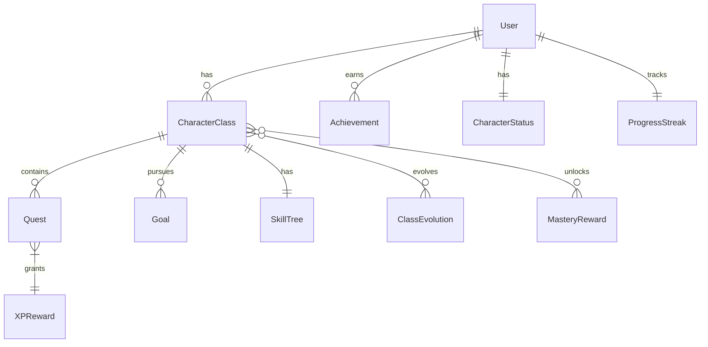

# Data Model: QuestLife

**Date**: 2025-09-10  
**Feature**: QuestLife - Gamified Goal Achievement Platform

## Entity Relationship Diagram



## Core Entities

### User
```typescript
interface User {
  id: string;                    // UUID
  createdAt: Date;
  updatedAt: Date;
  settings: {
    theme: 'dark' | 'light';
    notifications: boolean;
    soundEffects: boolean;
  };
}
```

### CharacterClass
```typescript
interface CharacterClass {
  id: string;                    // UUID
  userId: string;
  name: string;                  // "AI Scholar"
  description: string;
  level: number;                 // 1-30
  currentXP: number;
  xpToNextLevel: number;
  status: 'active' | 'mastered' | 'evolved';
  targetLevel: number;           // User's goal level
  ultimateGoal: string;          // "Launch AI product"
  createdAt: Date;
  masteredAt?: Date;
  
  // Relationships
  plannedEvolutions: string[];   // IDs of potential evolution targets
  baseClassIds?: string[];       // If this is an evolved class
}
```

### Quest
```typescript
interface Quest {
  id: string;
  classId: string;
  type: 'daily' | 'weekly' | 'monthly' | 'urgent' | 'special';
  title: string;
  description: string;
  xpReward: number;              // 20-1000+
  status: 'pending' | 'active' | 'completed' | 'expired';
  difficulty: 1 | 2 | 3 | 4 | 5;
  
  // Type-specific fields
  levelTrigger?: number;         // For special quests (10, 20, 30)
  timeLimit?: number;            // Minutes for urgent quests
  expiresAt?: Date;
  
  createdAt: Date;
  completedAt?: Date;
  
  // Tracking
  attemptCount: number;
  lastAttemptedAt?: Date;
}
```

### Goal
```typescript
interface Goal {
  id: string;
  classId: string;
  originalText: string;          // User's raw input
  processedGoal: string;         // LLM-processed version
  timeframe: number;             // Months to achieve
  milestones: {
    month: number;
    description: string;
    achieved: boolean;
  }[];
  weeklyTimeCommitment: number;  // Hours per week
  createdAt: Date;
  modifiedAt?: Date;
}
```

### ClassEvolution
```typescript
interface ClassEvolution {
  id: string;
  userId: string;
  baseClass1Id: string;
  baseClass2Id: string;
  evolvedClassId?: string;       // Created after evolution
  evolutionName: string;         // "Tech Content Producer"
  evolutionDescription: string;
  status: 'planned' | 'ready' | 'completed';
  unlockedAt?: Date;            // When both classes hit 30
  evolvedAt?: Date;
}
```

### Achievement
```typescript
interface Achievement {
  id: string;
  userId: string;
  type: string;                  // "first_quest", "level_10", "week_streak"
  name: string;
  description: string;
  icon: string;                  // Icon identifier
  rarity: 'common' | 'rare' | 'epic' | 'legendary';
  unlockedAt: Date;
  xpBonus?: number;
}
```

### CharacterStatus
```typescript
interface CharacterStatus {
  id: string;
  userId: string;
  
  // Base attributes
  strength: number;              // Physical/execution ability
  wisdom: number;                // Knowledge/learning ability
  creativity: number;            // Innovation/problem-solving
  discipline: number;            // Consistency/habit-forming
  charisma: number;             // Communication/leadership
  
  // Calculated values
  totalPowerLevel: number;       // Sum of all attributes
  masteredClassCount: number;
  totalQuestsCompleted: number;
  
  // Permanent bonuses from mastery
  permanentBonuses: {
    attributeType: string;
    value: number;
    source: string;            // Which class mastery
  }[];
  
  updatedAt: Date;
}
```

### MasteryReward
```typescript
interface MasteryReward {
  id: string;
  classId: string;
  userId: string;
  
  title: string;                // "AI Master"
  badge: string;                // Badge identifier
  
  // Permanent bonuses
  statBonuses: {
    strength?: number;
    wisdom?: number;
    creativity?: number;
    discipline?: number;
    charisma?: number;
  };
  
  // Visual rewards
  effectColor: string;          // Hex color for effects
  particleEffect: string;       // Effect identifier
  
  awardedAt: Date;
}
```

### SkillTree
```typescript
interface SkillTree {
  id: string;
  classId: string;
  
  skills: {
    id: string;
    name: string;
    description: string;
    tier: 1 | 2 | 3;           // Skill tier
    requiredLevel: number;
    requiredSkills: string[];  // Prerequisite skill IDs
    
    unlocked: boolean;
    unlockedAt?: Date;
    
    // Benefits when unlocked
    xpMultiplier?: number;
    questBonus?: string;
    specialAbility?: string;
  }[];
  
  availablePoints: number;     // Unspent skill points
  totalPointsEarned: number;
}
```

### ProgressStreak
```typescript
interface ProgressStreak {
  id: string;
  userId: string;
  
  currentStreak: number;        // Days in current streak
  longestStreak: number;        // Historical best
  
  multiplier: number;           // Current XP multiplier (1-5x)
  lastCompletionDate: Date;
  
  // Milestones
  streakMilestones: {
    days: number;              // 7, 30, 100
    achieved: boolean;
    achievedAt?: Date;
    reward?: string;
  }[];
}
```

### XPMultiplier
```typescript
interface XPMultiplier {
  id: string;
  userId: string;
  questId: string;
  
  baseXP: number;
  multiplierValue: number;      // 1x, 2x, 3x, 4x, 5x
  reason: 'streak' | 'urgent' | 'perfect_week' | 'special_event';
  finalXP: number;
  
  appliedAt: Date;
}
```

## Database Schema (SQLite)

```sql
-- Users table
CREATE TABLE users (
  id TEXT PRIMARY KEY,
  created_at DATETIME DEFAULT CURRENT_TIMESTAMP,
  updated_at DATETIME DEFAULT CURRENT_TIMESTAMP,
  settings TEXT -- JSON
);

-- Character classes
CREATE TABLE character_classes (
  id TEXT PRIMARY KEY,
  user_id TEXT NOT NULL,
  name TEXT NOT NULL,
  description TEXT,
  level INTEGER DEFAULT 1,
  current_xp INTEGER DEFAULT 0,
  xp_to_next_level INTEGER DEFAULT 100,
  status TEXT DEFAULT 'active',
  target_level INTEGER,
  ultimate_goal TEXT,
  created_at DATETIME DEFAULT CURRENT_TIMESTAMP,
  mastered_at DATETIME,
  planned_evolutions TEXT, -- JSON array
  base_class_ids TEXT, -- JSON array
  FOREIGN KEY (user_id) REFERENCES users(id)
);

-- Quests
CREATE TABLE quests (
  id TEXT PRIMARY KEY,
  class_id TEXT NOT NULL,
  type TEXT NOT NULL,
  title TEXT NOT NULL,
  description TEXT,
  xp_reward INTEGER NOT NULL,
  status TEXT DEFAULT 'pending',
  difficulty INTEGER DEFAULT 1,
  level_trigger INTEGER,
  time_limit INTEGER,
  expires_at DATETIME,
  created_at DATETIME DEFAULT CURRENT_TIMESTAMP,
  completed_at DATETIME,
  attempt_count INTEGER DEFAULT 0,
  last_attempted_at DATETIME,
  FOREIGN KEY (class_id) REFERENCES character_classes(id)
);

-- Goals
CREATE TABLE goals (
  id TEXT PRIMARY KEY,
  class_id TEXT NOT NULL,
  original_text TEXT NOT NULL,
  processed_goal TEXT,
  timeframe INTEGER,
  milestones TEXT, -- JSON
  weekly_time_commitment INTEGER,
  created_at DATETIME DEFAULT CURRENT_TIMESTAMP,
  modified_at DATETIME,
  FOREIGN KEY (class_id) REFERENCES character_classes(id)
);

-- Class evolutions
CREATE TABLE class_evolutions (
  id TEXT PRIMARY KEY,
  user_id TEXT NOT NULL,
  base_class1_id TEXT NOT NULL,
  base_class2_id TEXT NOT NULL,
  evolved_class_id TEXT,
  evolution_name TEXT NOT NULL,
  evolution_description TEXT,
  status TEXT DEFAULT 'planned',
  unlocked_at DATETIME,
  evolved_at DATETIME,
  FOREIGN KEY (user_id) REFERENCES users(id),
  FOREIGN KEY (base_class1_id) REFERENCES character_classes(id),
  FOREIGN KEY (base_class2_id) REFERENCES character_classes(id),
  FOREIGN KEY (evolved_class_id) REFERENCES character_classes(id)
);

-- Achievements
CREATE TABLE achievements (
  id TEXT PRIMARY KEY,
  user_id TEXT NOT NULL,
  type TEXT NOT NULL,
  name TEXT NOT NULL,
  description TEXT,
  icon TEXT,
  rarity TEXT DEFAULT 'common',
  unlocked_at DATETIME DEFAULT CURRENT_TIMESTAMP,
  xp_bonus INTEGER,
  FOREIGN KEY (user_id) REFERENCES users(id)
);

-- Character status (one per user)
CREATE TABLE character_status (
  id TEXT PRIMARY KEY,
  user_id TEXT UNIQUE NOT NULL,
  strength INTEGER DEFAULT 10,
  wisdom INTEGER DEFAULT 10,
  creativity INTEGER DEFAULT 10,
  discipline INTEGER DEFAULT 10,
  charisma INTEGER DEFAULT 10,
  total_power_level INTEGER DEFAULT 50,
  mastered_class_count INTEGER DEFAULT 0,
  total_quests_completed INTEGER DEFAULT 0,
  permanent_bonuses TEXT, -- JSON
  updated_at DATETIME DEFAULT CURRENT_TIMESTAMP,
  FOREIGN KEY (user_id) REFERENCES users(id)
);

-- Mastery rewards
CREATE TABLE mastery_rewards (
  id TEXT PRIMARY KEY,
  class_id TEXT NOT NULL,
  user_id TEXT NOT NULL,
  title TEXT NOT NULL,
  badge TEXT,
  stat_bonuses TEXT, -- JSON
  effect_color TEXT,
  particle_effect TEXT,
  awarded_at DATETIME DEFAULT CURRENT_TIMESTAMP,
  FOREIGN KEY (class_id) REFERENCES character_classes(id),
  FOREIGN KEY (user_id) REFERENCES users(id)
);

-- Skill trees
CREATE TABLE skill_trees (
  id TEXT PRIMARY KEY,
  class_id TEXT UNIQUE NOT NULL,
  skills TEXT NOT NULL, -- JSON
  available_points INTEGER DEFAULT 0,
  total_points_earned INTEGER DEFAULT 0,
  FOREIGN KEY (class_id) REFERENCES character_classes(id)
);

-- Progress streaks (one per user)
CREATE TABLE progress_streaks (
  id TEXT PRIMARY KEY,
  user_id TEXT UNIQUE NOT NULL,
  current_streak INTEGER DEFAULT 0,
  longest_streak INTEGER DEFAULT 0,
  multiplier REAL DEFAULT 1.0,
  last_completion_date DATE,
  streak_milestones TEXT, -- JSON
  FOREIGN KEY (user_id) REFERENCES users(id)
);

-- XP multipliers log
CREATE TABLE xp_multipliers (
  id TEXT PRIMARY KEY,
  user_id TEXT NOT NULL,
  quest_id TEXT NOT NULL,
  base_xp INTEGER NOT NULL,
  multiplier_value REAL NOT NULL,
  reason TEXT NOT NULL,
  final_xp INTEGER NOT NULL,
  applied_at DATETIME DEFAULT CURRENT_TIMESTAMP,
  FOREIGN KEY (user_id) REFERENCES users(id),
  FOREIGN KEY (quest_id) REFERENCES quests(id)
);

-- Optimized indexes for quest tracking
CREATE INDEX idx_classes_user ON character_classes(user_id);
CREATE INDEX idx_quests_class ON quests(class_id);
CREATE INDEX idx_quests_status ON quests(status);
CREATE INDEX idx_quests_type ON quests(type);
CREATE UNIQUE INDEX idx_quests_composite ON quests(class_id, status, type); -- Optimized for filtering
CREATE INDEX idx_quests_expires ON quests(expires_at) WHERE expires_at IS NOT NULL; -- Partial index for urgent
CREATE INDEX idx_achievements_user ON achievements(user_id);
CREATE INDEX idx_goals_class ON goals(class_id);

-- Additional performance indexes
CREATE INDEX idx_quests_completed ON quests(completed_at) WHERE completed_at IS NOT NULL;
CREATE INDEX idx_classes_active ON character_classes(user_id, status) WHERE status = 'active';
```

## State Transitions

### Quest Status Flow
```
pending → active → completed
         ↘      ↗
          expired (for urgent quests)
```

### Character Class Status Flow
```
active → mastered (level 30 + special quest)
      ↘
       evolved (when combined with another mastered class)
```

### Class Evolution Status Flow
```
planned → ready (both classes level 30) → completed
```

## XP Calculation System

### Core Formula
```typescript
interface XPCalculation {
  baseXP: number;        // From quest definition (20-1000+)
  level: number;         // Current character level (1-30)
  streakDays: number;    // Consecutive completion days (0-∞)
  
  calculate(): number {
    const comboMultiplier = Math.min(streakDays, 5); // Cap at 5x
    const levelBonus = 1 + (level / 100); // 1% bonus per level
    return Math.floor(baseXP * comboMultiplier * levelBonus);
  }
}

// Examples:
// Level 1, no streak, 50 XP quest = 50 XP
// Level 10, 3-day streak, 50 XP quest = 50 * 3 * 1.1 = 165 XP
// Level 30, 5-day streak, 100 XP quest = 100 * 5 * 1.3 = 650 XP
```

### XP Requirements per Level
```typescript
const xpToNextLevel = (currentLevel: number): number => {
  // Linear progression with slight curve for balanced gameplay
  const baseXP = 100;
  const increment = 50;
  return baseXP + (increment * (currentLevel - 1)) + (10 * Math.pow(currentLevel - 1, 1.2));
}

// Balanced progression:
// Level 1→2: 100 XP
// Level 5→6: 360 XP  
// Level 10→11: 720 XP
// Level 15→16: 1,150 XP
// Level 20→21: 1,650 XP
// Level 25→26: 2,220 XP
// Level 29→30: 2,700 XP
// Total XP (1→30): ~28,000 XP (achievable in 3 months)
```

### Quest XP Distribution
```typescript
const QUEST_XP_VALUES = {
  daily: {
    level_1_5: 40,    // Early game
    level_6_10: 50,   // Building habits
    level_11_15: 60,  // Intermediate
    level_16_20: 70,  // Advanced
    level_21_25: 80,  // Expert
    level_26_30: 100  // Master
  },
  weekly: {
    level_1_10: 300,
    level_11_20: 500,
    level_21_30: 800
  },
  special: {
    level_10: 1000,   // First milestone
    level_20: 2000,   // Major achievement
    level_30: 3000    // Class mastery
  },
  urgent: (baseXP: number) => baseXP * 2
};

// Daily XP potential by level range:
// Level 1-5: 120-200 XP/day (3 quests)
// Level 6-10: 200-250 XP/day (4 quests)
// Level 11-20: 300-400 XP/day (4-5 quests)
// Level 21-30: 400-600 XP/day (5 quests)
```

## OpenAI API Optimization

### Cache Strategy
```typescript
interface GoalCache {
  goalHash: string;      // SHA256 of normalized goal text
  generatedClass: GeneratedClass;
  createdAt: Date;
  expiresAt: Date;      // 24 hours later
  hitCount: number;
}

// Cache implementation in SQLite
CREATE TABLE goal_cache (
  goal_hash TEXT PRIMARY KEY,
  generated_class TEXT NOT NULL, -- JSON
  created_at DATETIME DEFAULT CURRENT_TIMESTAMP,
  expires_at DATETIME NOT NULL,
  hit_count INTEGER DEFAULT 1
);

CREATE INDEX idx_cache_expires ON goal_cache(expires_at);
```

### Batch Processing
```typescript
interface BatchGoalProcessor {
  queue: GoalRequest[];
  maxBatchSize: 5;
  maxWaitTime: 2000; // ms
  
  // Combine multiple goals into single prompt
  processBatch(): Promise<GeneratedClass[]> {
    const prompt = this.queue.map(g => g.text).join('\n---\n');
    // Single API call for multiple goals
    return openai.complete(prompt);
  }
}
```

### Token Optimization
```typescript
const SYSTEM_PROMPT = 150; // tokens
const MAX_RESPONSE = 350;  // tokens
const TOTAL_PER_CALL = 500; // tokens max

// Prompt template (pre-computed)
const template = {
  system: "Game master creating RPG classes...", // 150 tokens
  examples: [...], // Cached few-shot examples
  maxTokens: 350
};
```

## Validation Rules

1. **Character Class**:
   - Level must be between 1-30
   - XP cannot be negative
   - Status transitions are one-way

2. **Quest**:
   - XP reward ranges: daily (40-100 based on level), weekly (300-800), special (1000-3000)
   - Daily quest count: 3 (level 1-5), 4 (level 6-15), 5 (level 16-30)
   - Urgent quests must have time_limit
   - Special quests must have level_trigger (10, 20, or 30)

3. **Progress Streak**:
   - Multiplier caps at 5x
   - Resets if no completion in 24 hours
   - Milestones are cumulative

4. **Character Status**:
   - Attributes start at 10
   - Permanent bonuses stack
   - Power level = sum of all attributes

5. **Class Evolution**:
   - Both base classes must be level 30
   - Cannot evolve the same combination twice
   - Evolved class starts at level 1

---
*Data model defined for Phase 1 of implementation plan*