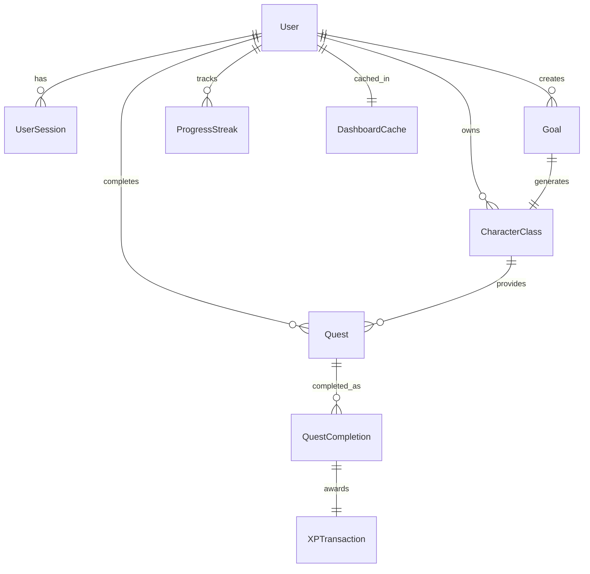

# Data Model: QuestLife Data Persistence

**Date**: 2025-09-20 | **Feature**: Data Persistence and API Integration

## Entity Relationships



## Core Entities

### User
**Purpose**: Core user identity with PIN authentication
```typescript
interface User {
  id: string;                    // UUID
  username: string;               // Unique identifier
  pin_hash: string;              // Hashed PIN
  created_at: string;            // ISO timestamp
  updated_at: string;            // ISO timestamp
  onboarding_completed: boolean; // Onboarding status
}
```

### UserSession
**Purpose**: JWT session management
```typescript
interface UserSession {
  id: string;           // UUID
  user_id: string;      // FK to User
  token: string;        // JWT token
  expires_at: string;   // ISO timestamp
  created_at: string;   // ISO timestamp
  last_activity: string;// ISO timestamp
  is_active: boolean;   // Session status
}
```

### DashboardData
**Purpose**: Aggregated dashboard view (computed, not stored)
```typescript
interface DashboardData {
  user: {
    username: string;
    level: number;
    currentXP: number;
    requiredXP: number;
    streak: number;
  };
  todayQuests: Quest[];
  weeklyQuests: Quest[];
  specialQuests: Quest[];
  streakInfo: {
    current: number;
    multiplier: number;
    nextMilestone: number;
  };
  recentCompletions: QuestCompletion[];
  stats: {
    totalQuestsCompleted: number;
    totalXPEarned: number;
    currentPowerLevel: number;
  };
}
```

### Quest
**Purpose**: Individual quest/task to complete
```typescript
interface Quest {
  id: string;              // UUID
  class_id: string;        // FK to CharacterClass
  title: string;           // Quest name
  description: string;     // Quest details
  type: 'daily' | 'weekly' | 'special';
  xp_reward: number;       // Base XP
  status: 'active' | 'completed' | 'expired';
  created_at: string;      // ISO timestamp
  completed_at?: string;   // ISO timestamp
  expires_at?: string;     // ISO timestamp
}
```

### QuestCompletion
**Purpose**: Record of completed quests with XP calculations
```typescript
interface QuestCompletion {
  id: string;              // UUID
  user_id: string;         // FK to User
  quest_id: string;        // FK to Quest
  base_xp: number;         // Original XP value
  multiplier: number;      // Streak multiplier applied
  total_xp: number;        // Final XP awarded
  completed_at: string;    // ISO timestamp
  streak_at_completion: number; // Streak value when completed
}
```

### Goal
**Purpose**: User-defined objectives
```typescript
interface Goal {
  id: string;              // UUID
  user_id: string;         // FK to User
  title: string;           // Goal title
  description: string;     // Natural language input
  class_id?: string;       // FK to generated CharacterClass
  status: 'active' | 'completed' | 'abandoned';
  created_at: string;      // ISO timestamp
  updated_at: string;      // ISO timestamp
}
```

### CharacterClass
**Purpose**: RPG class representing a goal
```typescript
interface CharacterClass {
  id: string;              // UUID
  user_id: string;         // FK to User
  goal_id?: string;        // FK to Goal (if generated from goal)
  name: string;            // Class name (e.g., "Code Warrior")
  description: string;     // Class description
  level: number;           // Current level (1-30)
  current_xp: number;      // XP in current level
  total_xp: number;        // Total XP earned
  attributes: {
    strength: number;
    intelligence: number;
    creativity: number;
    discipline: number;
  };
  skills: string[];        // Array of skill names
  evolution_ready: boolean;// True if level 30
  created_at: string;      // ISO timestamp
  updated_at: string;      // ISO timestamp
}
```

### ProgressStreak
**Purpose**: Track consecutive completion days
```typescript
interface ProgressStreak {
  id: string;              // UUID
  user_id: string;         // FK to User
  current_streak: number;  // Current consecutive days
  longest_streak: number;  // Historical best
  last_activity_date: string; // Date of last completion
  multiplier: number;      // Current XP multiplier (1-3)
  milestones_reached: number[]; // [7, 30, 100]
  created_at: string;      // ISO timestamp
  updated_at: string;      // ISO timestamp
}
```

### DashboardCache
**Purpose**: Performance optimization for dashboard
```typescript
interface DashboardCache {
  user_id: string;         // FK to User (Primary Key)
  data: string;            // JSON stringified DashboardData
  created_at: string;      // ISO timestamp
  expires_at: string;      // ISO timestamp (5 minutes)
  version: number;         // Cache version for invalidation
}
```

## State Transitions

### Quest Lifecycle
```
active → completed (via quick complete or full complete)
active → expired (via time expiration)
```

### Goal Lifecycle
```
active → completed (via user action)
active → abandoned (via user action)
```

### Session Lifecycle
```
created → active (via PIN verification)
active → expired (via timeout)
active → revoked (via logout)
```

## Validation Rules

### User
- `pin_hash`: Must be bcrypt hash of 4-6 digit PIN
- `username`: Must be unique, 3-20 characters

### Quest
- `xp_reward`: Must be positive integer
- `expires_at`: Must be future date for active quests
- `completed_at`: Required when status = 'completed'

### CharacterClass
- `level`: Must be between 1 and 30
- `current_xp`: Must be less than required XP for next level
- `attributes`: Each must be between 1 and 100
- `evolution_ready`: True only when level = 30

### QuestCompletion
- `multiplier`: Must be between 1 and 3
- `total_xp`: Must equal base_xp * multiplier
- `completed_at`: Cannot be future date

### ProgressStreak
- `current_streak`: Cannot exceed longest_streak
- `multiplier`: Calculated as min(3, 1 + floor(current_streak / 7))
- `last_activity_date`: Cannot be future date

## Indexes

```sql
-- Performance-critical queries
CREATE INDEX idx_quests_user_status ON quests(user_id, status);
CREATE INDEX idx_quests_expires ON quests(expires_at) WHERE status = 'active';
CREATE INDEX idx_quest_completions_user_date ON quest_completions(user_id, completed_at);
CREATE INDEX idx_character_classes_user ON character_classes(user_id);
CREATE INDEX idx_goals_user_status ON goals(user_id, status);
CREATE INDEX idx_dashboard_cache_expires ON dashboard_cache(expires_at);
CREATE UNIQUE INDEX idx_users_username ON users(username);
```

## Data Integrity Constraints

1. **XP Consistency**: Total quest XP must match character total XP
2. **Streak Continuity**: Streak breaks if no activity for >24 hours
3. **Level Boundaries**: XP resets to 0 when leveling up
4. **Cache Invalidation**: Cache expires after 5 minutes or on data mutation
5. **Token Expiry**: Sessions expire after 7 days of inactivity
6. **Quest Uniqueness**: No duplicate active quests for same user/class

---
*Data model defined. Ready for contract generation.*